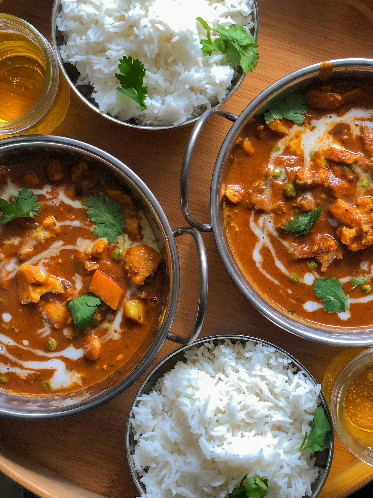
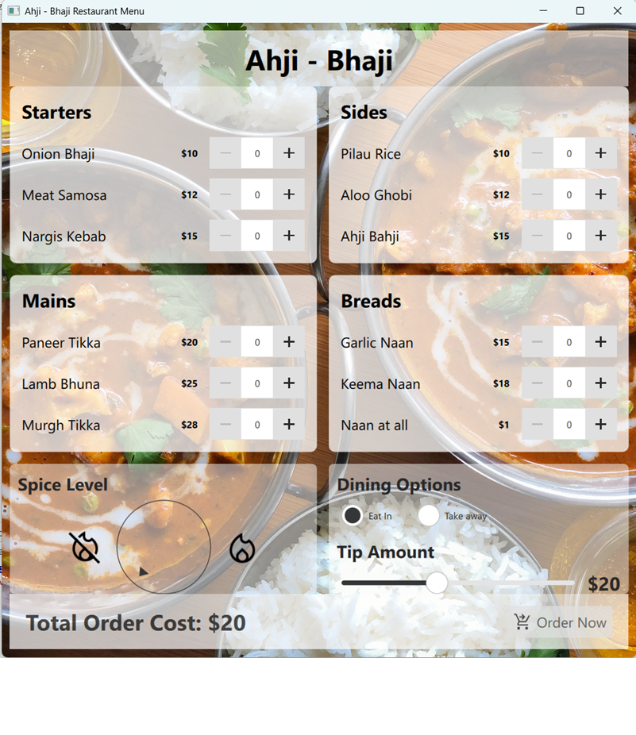

# 🎛️ Dynamic Restaurant Menu Dashboard (Qt6/QML)

A modern, fluid, and reactive user interface for a digital restaurant menu dashboard, ideal for self-service kiosks or waiter tablets. Built using **Qt 6**, **QML (Qt Quick Controls)**, and **JavaScript**.

 **

## 🚀 Key Features

* **Modular & Reusable Components:** Architected using a template-driven design pattern. Components like `MenuSide` (section container) and `MenuItemRow` (dish row) are fully decoupled, making the codebase clean and easy to maintain.
* **Fully Reactive Calculations:** Implements QML's powerful **Property Binding** to track quantities from `SpinBox` steppers and a tip `Slider` in real-time, instantly updating the total order cost in the footer.
* **Dual-Column Grid Layout:** Utilizes `RowLayout` and `ColumnLayout` for automated spacing and flawless scalability across various device resolutions without hardcoded pixel coordinates.
* **Context-Driven Styling:** Integrated transparent containers (`Pane`) over a rich vector/bitmap background with customized typographic weighting for clean visual hierarchy.

## 📁 Project Structure

* `Main.qml` - The root application window handling background asset rendering and core scaling.
* `MenuControl.qml` - The main controller coordinating headers, footers, reactive sum logic, and active layout distribution.
* `MenuSide.qml` - A reusable UI shell using `default property alias` to dynamically inject varying categories (Starters, Mains, Sides, Breads).
* `MenuItemRow.qml` - A standalone row controller managing independent dish names, prices, and `SpinBox` value states.

## 🛠️ Tech Stack & Concepts

* **Framework:** Qt 6 (Qt Quick / Qt Quick Controls Basic)
* **Languages:** QML, JavaScript (ES6+ for inline arithmetic operations)
* **Layout Engine:** Qt Quick Layouts (`RowLayout`, `ColumnLayout`, `Layout.fillWidth`)
* **Key Mechanisms:** Property Aliases, Property Bindings, Object Instancing

